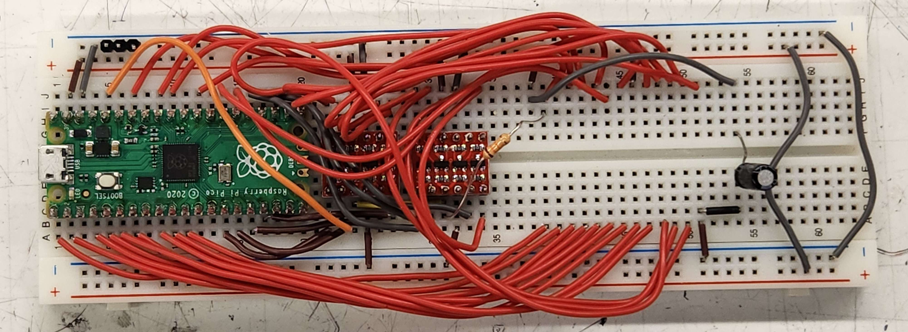

# Raspberry Pi Pico EEPROM Programmer

## Assembly

Each component should be laid out as in the picture below:

The wires are intentionally curved so that the further wires don't block the holes for the closer ones.
For detailed wire connections, reference the below diagram.

.
